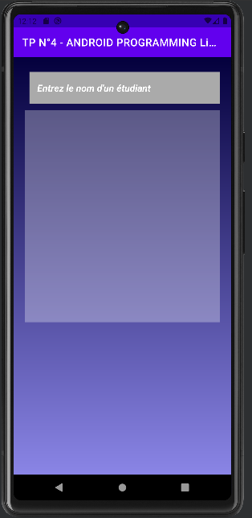
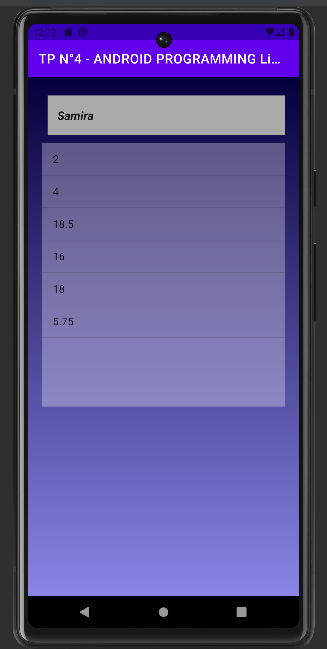

# TP N°4 - PROGRAMMATION ANDROID ListView, AutoCompleteTextView et Adapter
A brief description of what this project does.

## Table of Contents

- [Description](#Description)
- [Content](#Content)
- [Figures](#Figures)

## Description
    The objective of this lab is to display a student's grades in a ListView. By clicking on one of the student's grades, a Toast message will be displayed indicating whether the corresponding subject has been validated or not (grade <10 or not).

    Each student has 6 grades. The order of the grades is important since the nth grade of each student corresponds to the nth subject. We obviously need the list of subjects (6 subjects in total). When entering the name of a student, we will use an AutoCompleteTextView that will suggest student names based on the characters we have entered.

## Content of project
    To connect the list of grades to your ListView, it is imperative to use an adapter.

    - Version 1 (ArrayAdapter): 
        We will use an ArrayAdapter, which is a "predefined" adapter that can be used directly.
  
    - Version 2 (Custom Adapter) : 
        We want to customize the display of Views in the ListView. Each element of the ListView will be composed of an icon and the grade. We will specify 2 icons. One for validated subject grades and one for the others. To do this, we cannot use an ArrayAdapter, so we will need to create our own adapter. It will be a class that inherits from the ArrayAdapter class and in which we will implement a constructor and the getView method. 

    - Version 3 (Firebase) :
        Now, we want to connect our application to a Firebase database. The student's grades will then be loaded from Firebase when a student is selected. Additionally, we will create a new activity for adding a new student and their grades. By clicking the submit button, we will return directly to the MainActivity.

- 
- 
-

## Figures
    The figures below will give you a clearer idea of the expected result.

